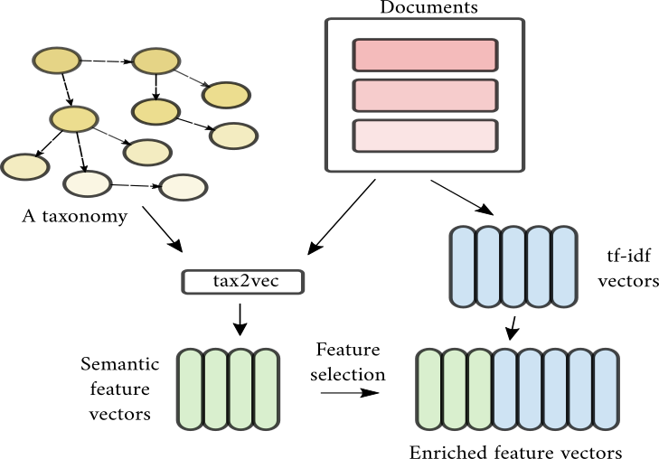
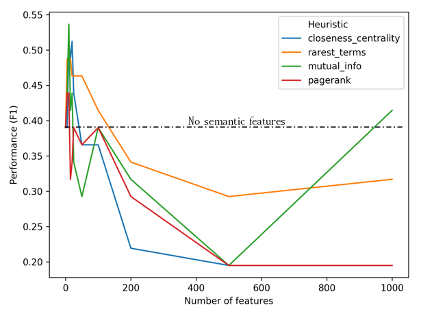

# tax2vec

Semantic space vectorization algorithm

## Short description

Tax2vec is a simple data enrichment approach. Its main goal is to extract corpus-relevant information in form of new features, which can be used for learning.
> Key idea: Inject semantic backgorund knowledge into raw textual data.


## Getting Started
Below you shall find instructions for installation of tax2vec library.

### Prerequisites

What things you need to install the software and how to install them

```
pip install -r requirements.txt
```
And also:
```
conda install --yes --file requirements.txt
```

### Installing

Installing is simple!

```
pip3 install tax2vec
```
And that's it. You can also install the library directly:

```
python3 setup.py install
```

Note that some of the tf-idf constructors use nltk addons. Tax2vec informs you when an addon is needed and how to install it. For example, to install punctuation, one does:

```
import nltk
nltk.download('punct')
```

## A self contained example

Assume you are given a blob of documents, and are asked to generate semantic features. The following examples starts from randomly selected Brexit Wikipedia article:

```python
## simplest possible use

import tax2vec as t2v
from tax2vec.preprocessing import *
import numpy as np

train_text = ["Brexit (/ˈbrɛksɪt, ˈbrɛɡzɪt/;[1] a portmanteau of British and exit) is the withdrawal of the United Kingdom (UK) from the European Union (EU). Following a referendum held on 23 June 2016 in which 51.9 per cent of those voting supported leaving the EU, the Government invoked Article 50 of the Treaty on European Union, starting a two-year process which was due to conclude with the UK's exit on 29 March 2019 – a deadline which has since been extended to 31 October 2019.[2]","Withdrawal from the EU has been advocated by both left-wing and right-wing Eurosceptics, while pro-Europeanists, who also span the political spectrum, have advocated continued membership and maintaining the customs union and single market. The UK joined the European Communities (EC) in 1973 under the Conservative government of Edward Heath, with continued membership endorsed by a referendum in 1975. In the 1970s and 1980s, withdrawal from the EC was advocated mainly by the political left, with the Labour Party's 1983 election manifesto advocating full withdrawal. From the 1990s, opposition to further European integration came mainly from the right, and divisions within the Conservative Party led to rebellion over the Maastricht Treaty in 1992. The growth of the UK Independence Party (UKIP) in the early 2010s and the influence of the cross-party People's Pledge campaign have been described as influential in bringing about a referendum. The Conservative Prime Minister, David Cameron, pledged during the campaign for the 2015 general election to hold a new referendum—a promise which he fulfilled in 2016 following pressure from the Eurosceptic wing of his party. Cameron, who had campaigned to remain, resigned after the result and was succeeded by Theresa May, his former Home Secretary. She called a snap general election less than a year later but lost her overall majority. Her minority government is supported in key votes by the Democratic Unionist Party.","The broad consensus among economists is that Brexit will likely reduce the UK's real per capita income in the medium term and long term, and that the Brexit referendum itself damaged the economy.[a] Studies on effects since the referendum show a reduction in GDP, trade and investment, as well as household losses from increased inflation. Brexit is likely to reduce immigration from European Economic Area (EEA) countries to the UK, and poses challenges for UK higher education and academic research. As of May 2019, the size of the divorce bill—the UK's inheritance of existing EU trade agreements—and relations with Ireland and other EU member states remains uncertain. The precise impact on the UK depends on whether the process will be a hard or soft Brexit."]

test_text = ["When the European Communities (EC) came into being in 1958, the UK chose to remain aloof and instead join the alternative bloc, EFTA. Almost immediately the British government regretted its decision, and in 1961, along with Denmark, Ireland and Norway, the UK applied to join the three Communities. However, President Charles de Gaulle saw British membership as a Trojan horse for US influence, and vetoed it; all four applications were suspended. The four countries resubmitted their applications in 1967, and the French veto was lifted upon Georges Pompidou succeeding de Gaulle in 1969.[2] In 1970, accession negotiations took place between the UK Government, led by Conservative Prime Minister Edward Heath, the European Communities and various European leaders. Despite disagreements over the CAP and the UK's relationship with the Commonwealth, terms were agreed. In October 1971, after a lengthy Commons debate, MPs voted 356-244 in favour of joining the EEC."]

## trainset part
train_sequences, tokenizer, mlen = data_docs_to_matrix(train_text, mode="index_word",simple_clean=True) ## simple clean removes english stopwords -> this is very basic preprocessing.
dmap = tokenizer.__dict__['word_index']

## optionally feed targets=target_matrix for supervised feature construction
## start_term_depth denotes how high in the taxonomy must a given feature be to be considered
tax2vec_instance = t2v.tax2vec(max_features=10, num_cpu=8, heuristic="pagerank", disambiguation_window = 2, start_term_depth = 3) 

semantic_features_train = tax2vec_instance.fit_transform(train_sequences, dmap)

## to obtain test features, simply transform.
test_sequences = tokenizer.texts_to_sequences(test_text) ## tokenizer is already fit on train data
semantic_features_test = tax2vec_instance.transform(test_sequences)
assert semantic_features_train.shape[1] == semantic_features_test.shape[1]

## what features are the most relevant?
for a,b in zip(tax2vec_instance.semantic_candidates,tax2vec_instance.pagerank_scores):
    print("{} with score: {}".format(a,b))

```
yields:

| Hypernym            | Score  | PageRank             |
|---------------------|--------|----------------------|
| vote.v.05           | score: | 0.020820367993329862 |
| edward.n.01         | score: | 0.011273376619092617 |
| david.n.03          | score: | 0.011263940537596226 |
| portmanteau.n.02    | score: | 0.011254504456099833 |
| british.n.01        | score: | 0.011254504456099833 |
| passing.n.02        | score: | 0.011254504456099833 |
| withdrawal.n.01     | score: | 0.011254504456099833 |
| united_kingdom.n.01 | score: | 0.011254504456099833 |
| european.n.01       | score: | 0.011254504456099833 |
| union.n.11          | score: | 0.011254504456099833 |

## Basic use
>Key idea: Generate word-index mapping of the corpus, use this as input along with (optional) classes.

First, import the library and some of the preprocessing methods..

```python
import tax2vec as t2v
from tax2vec.preprocessing import *
```

Next, we load the corpus using in-build methods. Note that any tokenizer can be used for this!

```python
# load corpus
labels, d_corpus,class_names = generate_corpus("./datasets/PAN_2016_age_srna_en.csv.gz",100000000000)

# Tokenize -> this is just to get the splits and class names.
sequence_word_matrix, _, _ = data_docs_to_matrix(d_corpus, mode="index_word")

# Split generator
split_gen = split_generator(sequence_word_matrix, d_corpus, labels, num_splits=1, test=0.1)

# Get splits
(train_x,test_x,train_y,test_y) = split_gen.next()

# Tokenize corpus
train_sequences,tokenizer,mlen = data_docs_to_matrix(train_x, mode="index_word")
test_sequences = tokenizer.texts_to_sequences(test_x)

# Important! Store the index-word mappings.
dmap = tokenizer.__dict__['word_index']

## tax2vec part
tax2vec_instance = t2v.tax2vec(max_features=30, targets=train_y,num_cpu=8,heuristic="closeness_centrality",class_names=class_names)

## fit and transform
semantic_features_train = tax2vec_instance.fit_transform(train_sequences, dmap)

## just transform
semantic_features_test = tax2vec_instance.transform(test_sequences)

## And that's it!

```

## Relevant hyperparameters
| Hyperparameter                   | Default value | Possible values                                                  |
|----------------------------------|---------------|------------------------------------------------------------------|
| max_features                     | 100           | int                                                              |
| disambiguation_window            | 3             | int                                                              |
| heuristic                        | "mutual_info" | ["closeness_centrality","rarest_terms","mutual_info","pagerank"] |
| num_cpu                          | 8             | int or "all" - automatic detection                                                             |
| hypernym_distribution (optional) | somefile.npy  | "./hypernym_space/dist1.npy"                                     |
| targets                          | None          | numeric vector of targets (for supervised feature ranking)       |
| class_names                      | None          | names of classes                                                 |
| start_term_depth                 | 0             | terms at depth *larger than this* will be considered             |


## Common behavior
Current experiments indicate, that a rather small number of semantic features can greatly impact the classifier's performance. See examples to
reproduce the following benchmark, based on the PAN Age data set.



## Example uses

To reproduce SOTA results on the classification task, you can run:
```
python3 demo_classification.py
```

To use custom feature constructor by Martinc et al. (2017)
```
python3 demo_classification_custom_features.py
```

To reproduce the explainability features:

```
python3 demo_explain_corpus.py
```

And to use it in an unsupervised setting:

```
python3 demo_explain_unsupervised.py
```

## Contributing

To contribute, simply open an issue or a pull request!

## Authors

tax2vec was created by Blaž Škrlj, Jan Kralj, Matej Martinc, Nada Lavrač and Senja Pollak.

## License

See LICENSE.md for more details.

## Citation
Please cite:

```
@misc{krlj2019tax2vec,
    title={tax2vec: Constructing Interpretable Features from Taxonomies for Short Text Classification},
    author={Blaž Škrlj and Matej Martinc and Jan Kralj and Nada Lavrač and Senja Pollak},
    year={2019},
    eprint={1902.00438},
    archivePrefix={arXiv},
    primaryClass={cs.CL}
}
```

https://arxiv.org/abs/1902.00438